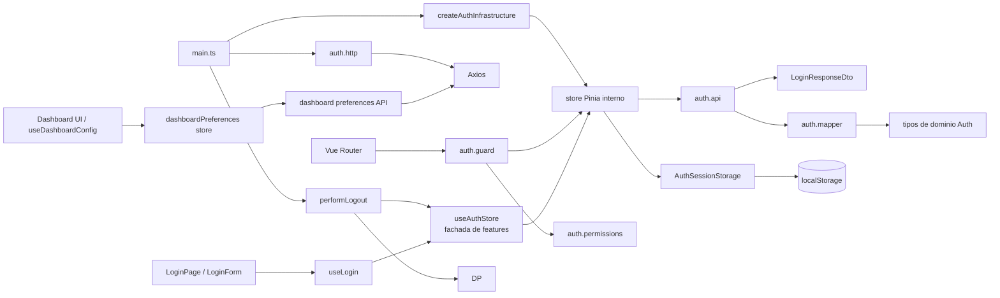
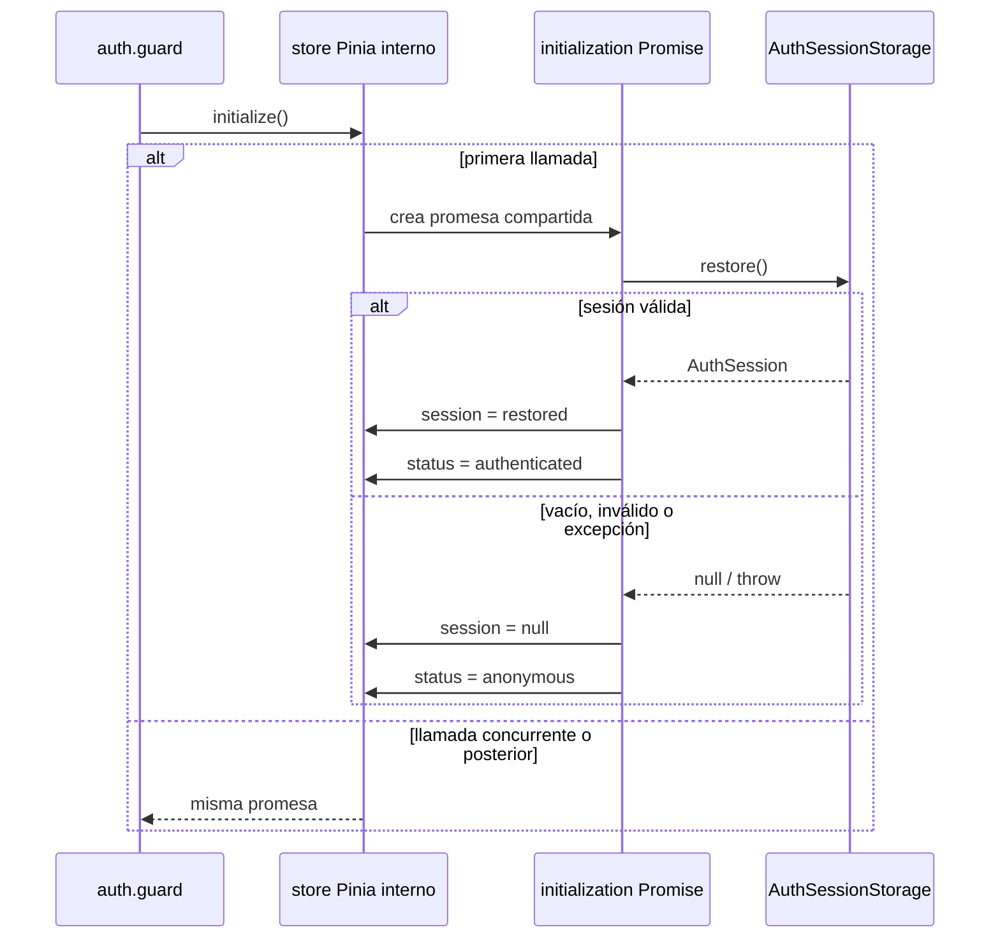
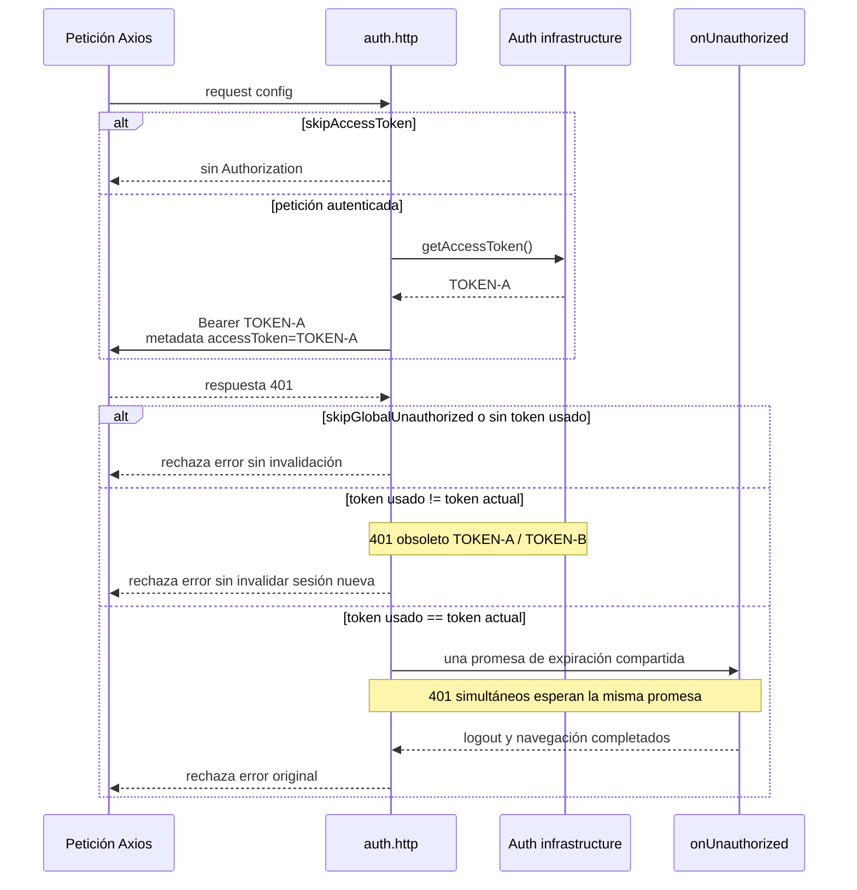
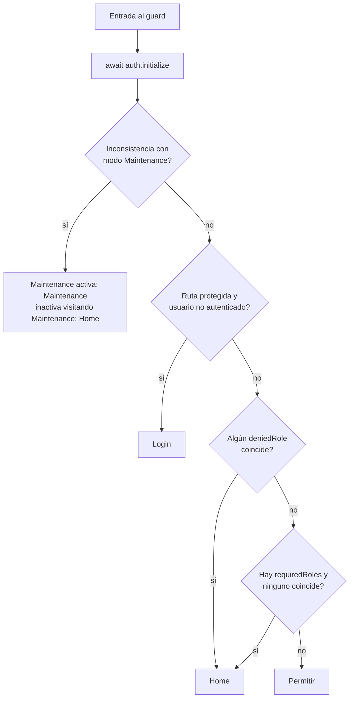

# Arquitectura Auth

## 1. Propósito y alcance

Este documento describe la arquitectura de autenticación y autorización implementada actualmente. La fuente de verdad es el código del branch, incluidos los ajustes de los commits `fb6b8cfd`, `e453b8e` y `367759b`.

El módulo `src/modules/auth` es responsable de:

- autenticar mediante usuario y contraseña;
- representar, restaurar, persistir e invalidar la sesión;
- exponer el usuario autenticado y sus roles como estado derivado;
- decidir autorización de rutas y adaptar esa decisión a Vue Router;
- aportar el token al cliente Axios;
- coordinar el tratamiento global de respuestas `401`;
- implementar la pantalla de login y sus fondos animados.

No pertenecen al dominio Auth:

- las preferencias de dashboard (`dashboardConfig` y `mobileDashboardConfig`);
- el tema visual (`theme`) y el modo de fondo del login (`bgMode`);
- perfil, cambio de contraseña y administración de usuarios;
- solicitudes de acceso;
- la navegación no pertenece al store ni al dominio Auth; las capas de aplicación/UI, como `useLogin`, el guard o el bootstrap, pueden coordinarla como parte de sus respectivos flujos;
- recarga de página tras el logout;
- configuración general de Axios o Vue Router.

Aunque el backend todavía incluye preferencias de dashboard en la respuesta legacy de login, el frontend las ignora. Dashboard carga y guarda sus preferencias mediante `/dashboard/preferences`; su tipo y estado pertenecen a `src/services/dashboard/preferences.ts` y `src/stores/dashboardPreferences.ts`. `theme` y `bgMode` son preferencias locales de UI gestionadas por la pantalla de login y no forman parte de la sesión.

## 2. Estructura real

```text
src/modules/auth/
├── api/
│   ├── auth.api.ts
│   └── auth.dto.ts
├── components/
│   ├── LoginBackground.test.ts
│   ├── LoginBackground.vue
│   ├── LoginForm.test.ts
│   └── LoginForm.vue
├── composables/
│   └── useLogin.ts
├── model/
│   ├── auth.mapper.test.ts
│   ├── auth.mapper.ts
│   ├── auth.permissions.test.ts
│   ├── auth.permissions.ts
│   ├── auth.storage.test.ts
│   ├── auth.storage.ts
│   ├── auth.store.test.ts
│   ├── auth.store.ts
│   └── auth.types.ts
├── pages/
│   └── LoginPage.vue
├── auth.architecture.test.ts
├── auth.guard.test.ts
├── auth.guard.ts
├── auth.http.test.ts
├── auth.http.ts
└── index.ts
```

Integraciones externas directas relevantes:

```text
src/application/logout.ts
src/stores/dashboardPreferences.ts
src/main.ts
src/router/index.ts
src/vite-env.d.ts
src/layouts/default/components/SidebarMenu.vue
```

## 3. Dependencias y flujo general



Las dependencias internas siguen estas reglas:

Los internals de `src/modules/auth` pueden colaborar mediante imports relativos. La restricción de acceso exclusivo a `@/modules/auth` se aplica a consumidores externos; el barrel es la frontera pública del módulo, no una capa que los propios internals deban atravesar.

- `auth.api.ts` conoce el DTO, el mapper y las credenciales, pero no el storage ni la UI.
- `auth.mapper.ts` valida el DTO y produce exclusivamente una sesión de dominio Auth.
- `auth.store.ts` coordina API, estado y `AuthSessionStorage`; no accede directamente a `localStorage` ni serializa JSON.
- `auth.storage.ts` es el único propietario de las claves de sesión, el documento versionado y la migración legacy.
- `auth.permissions.ts` es una política pura, independiente de Vue Router y Pinia.
- `auth.guard.ts` adapta metadatos de rutas y resultados de la política a destinos de navegación.
- `auth.http.ts` solo conoce callbacks; no importa Pinia ni Vue Router.
- `main.ts` ensambla Pinia, Axios, logout y navegación.

## 4. Modelo de dominio

### Roles

El conjunto cerrado de roles es:

```ts
type Role =
  | 'babyUser'
  | 'user'
  | 'riffValley'
  | 'superUser'
  | 'admin';
```

`ROLES` es una tupla constante usada también para validación runtime. No existe jerarquía ni herencia implícita. En particular, `admin` es un rol exacto y no obtiene automáticamente permisos de `user`, `riffValley` o `superUser`.

### Usuario y sesión

```ts
interface AuthenticatedUser {
  id: string;
  username: string;
  avatarUrl: string | null;
  roles: Role[];
}

interface AuthSession {
  token: string;
  user: AuthenticatedUser;
}
```

La sesión contiene exclusivamente credenciales de acceso y la identidad Auth. No contiene preferencias de dashboard, perfil ampliado ni preferencias visuales.

`CurrentUserPatch` está restringido a:

```ts
type CurrentUserPatch = Partial<Pick<AuthenticatedUser, 'avatarUrl'>>;
```

Por tanto, `updateCurrentUser()` no ofrece una vía para alterar identidad o roles.

Los motivos aceptados por logout son:

```ts
type LogoutReason = 'manual' | 'expired' | 'invalid-session';
```

El store acepta el motivo para conservar el contrato de orquestación, aunque actualmente su limpieza interna es la misma para los tres valores.

## 5. Store Pinia interno y fachada de features

`createAuthStore(sessionStorage)` construye el setup store Pinia interno. Esta factoría permite inyectar un storage en memoria en tests sin contenedor de dependencias.

El único estado Auth mutable es:

```ts
const status = ref<AuthStatus>('initializing');
const session = ref<AuthSession | null>(null);
```

Ambos refs se devuelven desde el setup store y quedan registrados en `$state`. No existen estados independientes para token, usuario, avatar o roles.

El resto se deriva de `session` y `status`:

```ts
currentUser     = session?.user ?? null
roles           = currentUser?.roles ?? []
isAuthenticated = status === 'authenticated'
```

Hay dos superficies distintas sobre el mismo store interno:

1. `useAuthStore(pinia?)`, fachada para features. Expone `status`, `currentUser`, `roles`, `isAuthenticated`, `initialize`, `login`, `logout`, `hasRole`, `hasAnyRole` y `updateCurrentUser`. No expone `session`, el token ni `getAccessToken`.
2. `createAuthInfrastructure(pinia)`, API de infraestructura. Expone únicamente `getAccessToken()`, que lee el token desde la sesión del store interno.

La instancia explícita de Pinia usada por infraestructura se entrega desde `main.ts`; no existe un service locator ni un contenedor DI.

## 6. API pública de `@/modules/auth`

El barrel `src/modules/auth/index.ts` exporta exactamente:

```ts
useAuthStore
createAuthInfrastructure
configureAuthHttp
authGuard
LoginPage

type LogoutReason
type Role
```

DTO, mapper, storage, sesión y tipos internos no forman parte del barrel. Los consumidores externos deben importar desde `@/modules/auth`; los deep imports bajo `@/modules/auth/...` están prohibidos. Los imports relativos dentro del propio módulo sí son válidos.

## 7. Persistencia de sesión

### Puerto

`AuthSessionStorage` es un puerto pequeño y específico de Auth:

```ts
interface AuthSessionStorage {
  restore(): AuthSession | null;
  persist(session: AuthSession): void;
  clear(): void;
}
```

No es un repository general. No conoce dashboard, tema, fondo ni navegación.

### Documento V1

La implementación de navegador usa la clave `rv.auth.session.v1` y persiste:

```ts
interface StoredAuthSessionV1 {
  version: 1;
  token: string;
  user: AuthSession['user'];
}
```

La restauración valida manualmente el documento leído como `unknown`: versión, token no vacío, usuario, avatar y todos los roles. Un documento corrupto, incompleto, con otra versión o con un rol desconocido se elimina y produce `null`.

### Migración legacy

Si no existe V1, el adapter busca `token`, `username`, `userId`, `image` y `roles`. Una migración válida:

1. exige token, username, userId y roles;
2. convierte `image` en `avatarUrl`, usando `null` si no existe;
3. acepta roles almacenados como array JSON o como CSV histórico;
4. persiste el documento V1;
5. elimina todas las claves Auth legacy.

Si la sesión legacy está incompleta o los roles son inválidos, las claves legacy se limpian y se devuelve `null`. Una cadena que parece JSON malformado no se reinterpreta como CSV.

La validación es *fail-closed*: `parseRoles()` usa un type guard real contra `ROLES`; basta un rol desconocido para rechazar el array completo. La misma política se aplica al DTO de login, al documento V1 y a la migración.

`clear()` elimina V1 y las claves Auth legacy, pero deliberadamente no toca `dashboardConfig` ni `mobileDashboardConfig`.

## 8. Inicialización

`initialize(): Promise<void>` restaura una sesión una sola vez por instancia del store. Una promesa interna `initialization` se crea en la primera llamada y se reutiliza tanto para llamadas concurrentes como posteriores.



El guard espera siempre a que la promesa termine antes de decidir acceso. El store absorbe errores de restauración y termina en estado anónimo.

## 9. Login

### DTO y mapper

`LoginResponseDto` trata los datos del backend como `unknown`:

```ts
interface LoginResponseDto {
  id: unknown;
  username: unknown;
  token: unknown;
  roles: unknown;
  image?: unknown;
}
```

`roles` es obligatorio. El mapper rechaza roles ausentes, valores que no sean arrays y roles desconocidos, además de validar identidad, token e imagen.

`mapLoginResponse()` devuelve directamente `AuthSession`. Los campos adicionales de la respuesta legacy del backend se toleran e ignoran: Auth no los declara, valida, mapea ni persiste. `LoginBootstrapResult` y `legacyDashboardPreferences` ya no existen.

### Flujo completo

```mermaid
sequenceDiagram
    actor U as Usuario
    participant F as LoginForm
    participant C as useLogin
    participant S as Auth store
    participant A as auth.api
    participant M as auth.mapper
    participant P as AuthSessionStorage
    participant R as Vue Router

    U->>F: submit usuario/password
    F->>C: submit()
    C->>C: error = null; loading = true
    C->>S: login(credentials)
    S->>A: requestLogin(credentials)
    A->>A: POST /auth/login<br/>sin token y sin 401 global
    A->>M: mapLoginResponse(response.data)
    M-->>S: AuthSession
    S->>P: persist(session)
    S->>S: session = result<br/>status = authenticated
    S-->>C: login completado
    C->>R: push(Home)
    C->>C: loading = false
```

Si cualquier paso falla, `useLogin` muestra el mensaje estable `Acceso fallido. Revisa tus credenciales.` y restablece `loading`. La navegación queda fuera del store Auth y el flujo no conoce preferencias de dashboard.

## 10. Integración Axios y expiración

`configureAuthHttp(client, options)` recibe dos callbacks:

```ts
getAccessToken(): string | null
onUnauthorized(): void | Promise<void>
```

No importa Pinia ni Router. `main.ts` crea `authInfrastructure` con la instancia explícita de Pinia y conecta los callbacks al cliente Axios.

La metadata Axios ampliada vive en `authMeta` y admite:

- `skipAccessToken`: impide adjuntar el token;
- `skipGlobalUnauthorized`: impide ejecutar el tratamiento global de un `401`;
- `accessToken`: metadata interna que registra el token usado por la petición.

`AxiosRequestConfig.auth` no se utiliza para metadata Auth: es una opción reservada de Axios para HTTP Basic Auth y puede sobrescribir la cabecera `Authorization`. Mantener la metadata del módulo bajo `authMeta` garantiza que las peticiones autenticadas conserven `Authorization: Bearer <token>`.

El endpoint de login marca las dos opciones `skip...` como `true`. Así no envía un token anterior y un `401` de credenciales incorrectas permanece como error local del formulario, sin expirar la sesión global.



La variable `expiration` coalesce varios `401` simultáneos: solo la primera respuesta inicia `onUnauthorized`; las demás esperan esa promesa. Al finalizar se libera para futuras expiraciones.

En `main.ts`, `onUnauthorized` ejecuta `performLogout(useAuthStore(pinia), 'expired')` y navega a `Login` salvo que ya se esté allí.

## 11. Logout y preferencias de dashboard

Dashboard obtiene ambos arrays mediante `GET /dashboard/preferences` al crear `useDashboardConfig`. `loadDashboardPreferences()` comparte la petición concurrente y reutiliza el estado ya cargado, evitando un GET por cada instancia desktop/mobile. Los cambios se guardan con `PATCH /dashboard/preferences`, enviando siempre `dashboardConfig` y `mobileDashboardConfig` completos mediante el cliente Axios compartido; el Bearer lo añade la infraestructura Auth.

El estado reactivo pertenece a `src/stores/dashboardPreferences.ts`. `useDashboardConfig` proyecta ese estado sobre la definición visual de módulos y mantiene sincronizadas sus instancias. La compatibilidad con la clave local histórica `rv_dashboard_config` se migra desde Dashboard, después de la carga remota, y nunca desde login. Las claves anteriores `dashboardConfig` y `mobileDashboardConfig` solo se eliminan durante logout; ya no son fuente de carga ni persistencia.

El logout Auth solo limpia sesión y cambia el estado a anónimo. La limpieza del estado Dashboard se conserva mediante una orquestación de aplicación:

```mermaid
flowchart LR
    M[Logout manual<br/>SidebarMenu] --> P[performLogout]
    E[Expiración 401<br/>main.ts] --> P
    P --> A[auth.logout(reason)]
    A --> S[AuthSessionStorage.clear]
    A --> ST[session = null<br/>status = anonymous]
    P --> D[clearDashboardPreferences]
    D --> DR[estado reactivo = null]
    D --> DL[elimina dashboardConfig<br/>y mobileDashboardConfig]
    M --> R[window.location.href = /]
    E --> L[router.push Login]
```

`performLogout(auth, reason)` pertenece a `src/application/logout.ts`: coordina dos propietarios distintos sin trasladar responsabilidades de dashboard al módulo Auth.

- Logout manual: `SidebarMenu` llama a `performLogout(authStore)` y después asigna `window.location.href = '/'`, conservando la recarga actual.
- Expiración: `main.ts` llama a `performLogout(..., 'expired')` y navega a `Login`.

## 12. Autorización y guard

`decideAccess()` recibe estado, roles, restricciones y flags de mantenimiento. Devuelve una decisión pura:

```ts
type AccessDecision =
  | { allowed: true }
  | {
      allowed: false;
      reason: 'anonymous' | 'missing-role' | 'denied-role' | 'maintenance';
    };
```

Orden efectivo de decisión:

1. mantenimiento activo fuera de `Maintenance`, o mantenimiento inactivo visitando `Maintenance`;
2. autenticación;
3. coincidencia con `deniedRoles`;
4. ausencia de coincidencia con `requiredRoles`;
5. acceso permitido.

`requiredRoles` usa semántica **ANY**: basta uno de los roles declarados. `deniedRoles` también coincide con cualquiera y tiene prioridad sobre `requiredRoles`. No existe expansión jerárquica de roles.



El guard agrega `requiredRoles` y `deniedRoles` de todos los records coincidentes de la ruta. Para rutas públicas ordinarias, tras inicializar permite acceso sin aplicar autenticación; mantenimiento sigue evaluándose. Los destinos son:

- `anonymous` → `Login`;
- `missing-role` → `Home`;
- `denied-role` → `Home`;
- `maintenance` → `Maintenance` si está activo, o `Home` al abandonar una página Maintenance inactiva.

La ruta `/import` declara `requiresAuth: true` y `deniedRoles: ['babyUser']`; un usuario con `babyUser` es enviado a `Home`, aunque tenga además un rol requerido por otra regla.

Los tipos de `RouteMeta` se amplían en `src/vite-env.d.ts` usando el `Role` público.

## 13. Pantalla de login

La pantalla conserva la apariencia y las animaciones legacy, pero distribuye responsabilidades:

```text
LoginPage
├── LoginForm
│   └── useLogin
├── LoginBackground
├── HowToUseModal (externo a Auth)
└── AccessRequestModal (externo a Auth)
```

- `LoginPage.vue` compone tarjeta, cabecera, accesos inferiores, solicitud de acceso, redes sociales, tooltips, selector light/dark y modales. Gestiona `theme` directamente como preferencia visual.
- `LoginForm.vue` contiene campos, visibilidad de contraseña, estados visuales, loading y error. Delega el flujo a `useLogin`.
- `useLogin.ts` coordina Auth y navegación a `Home`; no importa ni inicializa Dashboard.
- `LoginBackground.vue` es propietario del canvas, selector FAB, `bgMode`, ondas, partículas, blobs, puntero, resize y ciclo de animación.

El FAB permite `none`, `waves`, `constellation` y `nebula`, persiste `bgMode`, se abre en arco, selecciona y cierra una opción, y se cierra al pulsar fuera mediante `LoginPage` llamando al método expuesto `closeSelector()`.

Modos de canvas:

- `none`: limpia el canvas sin dibujar.
- `waves`: ocho ondas con frecuencia, amplitud, velocidad, fase, altura, grosor y colores light/dark propios; usa gradiente horizontal, fade lateral y amplitud influida por la posición vertical suavizada del ratón.
- `constellation`: partículas de radio y deriva variables, repulsión del ratón, recuperación hacia velocidad base, damping, límite de velocidad, wrap y conexiones cuya opacidad depende de distancia y tema.
- `nebula`: seis blobs con colores light/dark, posición, velocidad, radio y fase propios; combina deriva lineal con seno/coseno, wrap, respiración y gradientes radiales de tres stops.

La extracción conserva la configuración y el comportamiento visual legacy; no sustituye las animaciones por aproximaciones genéricas.

### Lifecycle y cleanup

Al montar, `LoginBackground` dimensiona el canvas, inicializa partículas y blobs, registra listeners `resize` y `mousemove`, y arranca `requestAnimationFrame`. Al desmontar cancela explícitamente el RAF y elimina ambos listeners. No guarda callbacks mediante propiedades dinámicas ni usa un `_cleanup` con `any`.

## 14. Frontera de imports

Todo consumidor externo debe usar:

```ts
import { ... } from '@/modules/auth';
```

No debe importar archivos bajo `@/modules/auth/...`. `auth.architecture.test.ts` recorre los archivos de `src`, excluye el propio módulo y falla si encuentra un deep import externo. Esta prueba protege la libertad de reorganizar internals sin ampliar accidentalmente la API pública.

## 15. Suite de tests actual

El script `yarn test:auth` ejecuta los tests situados bajo `src/modules/auth`. En la verificación de este lote ejecutó **9 archivos y 35 tests**, todos correctos. Los grupos actuales protegen:

| Archivo | Contratos cubiertos |
| --- | --- |
| `auth.mapper.test.ts` | sesión Auth mapeada, campos legacy adicionales ignorados, roles válidos, rol desconocido y roles ausentes |
| `auth.permissions.test.ts` | `requiredRoles` ANY, prioridad de denegación, ausencia de jerarquía para `admin` y prioridad de mantenimiento |
| `auth.storage.test.ts` | documento V1, rechazo y limpieza de V1 inválido, migración JSON/CSV y separación del dashboard |
| `auth.store.test.ts` | inicialización concurrente/idempotente, estado derivado, registro de `session` en Pinia, login persistido, avatar, logout y fachada sin sesión/token |
| `auth.http.test.ts` | token actual, `authMeta` separado del Basic Auth reservado de Axios, bypass de token, bypass de 401 de login, coalescencia de 401 y protección TOKEN-A/TOKEN-B |
| `auth.guard.test.ts` | espera de inicialización y destinos para anónimo, rol ausente, `/import`, mantenimiento activo e inactivo |
| `LoginForm.test.ts` | binding de credenciales, submit, visibilidad de contraseña, loading/disabled y error estable |
| `LoginBackground.test.ts` | creación y cleanup explícito de RAF, resize y mousemove |
| `auth.architecture.test.ts` | prohibición de deep imports externos y ausencia del bridge Dashboard en Auth productivo |

Fuera del script `test:auth`, pero directamente relacionados:

- `src/application/logout.test.ts` comprueba que la orquestación delega logout y limpia el estado y las claves anteriores;
- `src/stores/dashboardPreferences.test.ts` comprueba carga compartida, guardado de ambos arrays y limpieza reactiva/local;
- `src/services/dashboard/preferences.test.ts` comprueba los endpoints propios y el Bearer añadido por el Axios compartido.

## 16. Invariantes arquitectónicas

Los siguientes puntos deben permanecer ciertos:

- `status + session` son el único estado Auth mutable.
- Usuario, roles y autenticación son proyecciones derivadas.
- Pinia registra `session`, pero la fachada de features no la expone.
- El token solo está disponible mediante `createAuthInfrastructure()`.
- Roles desconocidos invalidan completamente sesión o respuesta.
- Los roles son exactos y no tienen jerarquía implícita.
- El mapper produce exclusivamente `AuthSession` e ignora campos adicionales de la respuesta legacy.
- `LoginBootstrapResult` y `legacyDashboardPreferences` no existen.
- `AuthSessionStorage` es el único código que conoce claves Auth, JSON, V1 y migración.
- Dashboard, `theme` y `bgMode` permanecen fuera de `AuthSessionStorage`.
- Dashboard se carga y guarda mediante `/dashboard/preferences`, nunca mediante login o `PATCH /auth`.
- `initialize()` comparte una única restauración.
- Axios permanece desacoplado de Pinia y Router.
- Un `401` de login no expira la sesión global.
- Los `401` simultáneos coalescen y un `401` obsoleto no destruye una sesión nueva.
- Auth no navega directamente; la navegación vive en composables, guard o bootstrap según el flujo.
- La autorización de rutas se decide mediante la política pura.
- Los consumidores externos usan únicamente el barrel.
- `LoginBackground` conserva las animaciones legacy y limpia todos sus recursos.

## 17. Antipatrones que no deben reintroducirse

- Leer o escribir `token`, `username`, `userId`, `image` o `roles` directamente fuera de `auth.storage.ts`.
- Crear refs independientes para token, usuario, avatar o roles.
- Exponer `session` o `getAccessToken()` en la fachada de features.
- Exportar DTO, mapper, storage o sesión desde el barrel por conveniencia.
- Usar casts para aceptar roles no validados o tolerar roles desconocidos.
- Convertir `admin` en un rol jerárquico.
- Mover dashboard, `theme` o `bgMode` a la sesión Auth.
- Leer preferencias Dashboard desde la respuesta de login o guardarlas mediante `PATCH /auth`.
- Hacer que Axios importe Pinia o Vue Router.
- Navegar desde el store Auth o desde `auth.http.ts`.
- Procesar globalmente el `401` del login.
- Invalidar la sesión actual por un `401` emitido con un token anterior.
- Duplicar la lógica de permisos manualmente en el guard.
- Introducir deep imports externos al módulo.
- Simplificar o reinterpretar visualmente el login y sus animaciones.
- Recuperar cleanup mediante propiedades dinámicas del canvas o `any`.

## 18. Checklist para futuros cambios

- [ ] ¿El cambio mantiene `status + session` como único estado mutable?
- [ ] ¿Los nuevos datos pertenecen realmente a Auth y no a perfil, dashboard o UI?
- [ ] ¿Todo rol recibido se valida con política fail-closed?
- [ ] ¿Se mantiene la ausencia de jerarquía y la semántica ANY?
- [ ] ¿La API de features sigue sin exponer sesión ni token?
- [ ] ¿Los consumidores externos importan solo desde `@/modules/auth`?
- [ ] ¿El store sigue usando exclusivamente el puerto `AuthSessionStorage`?
- [ ] ¿Las claves y migraciones Auth siguen confinadas a `auth.storage.ts`?
- [ ] ¿Un cambio de login conserva `skipAccessToken` y `skipGlobalUnauthorized`?
- [ ] ¿La lógica 401 conserva coalescencia y comparación token usado/token actual?
- [ ] ¿Logout manual y expiración siguen pasando por `performLogout()`?
- [ ] ¿La limpieza del dashboard permanece en su propietario externo?
- [ ] ¿Dashboard sigue cargando y guardando ambos arrays mediante `/dashboard/preferences`?
- [ ] ¿El guard espera `initialize()` y mantiene los destinos actuales?
- [ ] ¿Los cambios de UI conservan exactamente la apariencia y animaciones legacy?
- [ ] ¿Todo listener, timer o RAF nuevo tiene cleanup explícito?
- [ ] ¿Se añadieron o ajustaron tests del contrato afectado sin duplicar cobertura innecesaria?
- [ ] ¿Pasan `yarn test:auth`, los tests externos relacionados, typecheck, build y `git diff --check`?
